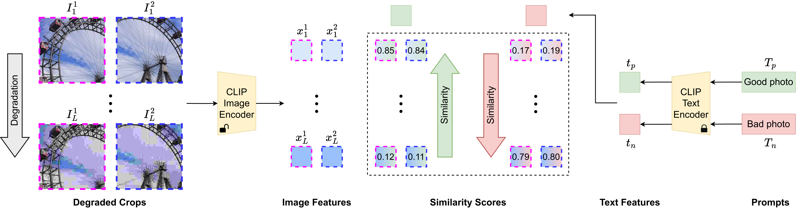

# QualiCLIP

### Quality-aware Image-Text Alignment for Real-World Image Quality Assessment

[](https://arxiv.org/abs/2403.11176)
[](https://github.com/miccunifi/QualiCLIP)

**🔥🔥🔥 [2025/01/15] QualiCLIP is now included in the [IQA-PyTorch](https://github.com/chaofengc/IQA-PyTorch)  library**

This is the **official repository** of the [**paper**](https://arxiv.org/abs/2403.11176) "*Quality-aware Image-Text Alignment for Real-World Image Quality Assessment*".

> [!NOTE] 
> If you are interested in IQA, take a look at our [new dataset](https://arxiv.org/abs/2406.17472) with UHD images and our [self-supervised](https://github.com/miccunifi/ARNIQA) NR-IQA model

## Overview

### Abstract
No-Reference Image Quality Assessment (NR-IQA) focuses on designing methods to measure image quality in alignment with human perception when a high-quality reference image is unavailable. The reliance on human-annotated Mean Opinion Score (MOS) in the majority of state-of-the-art NR-IQA approaches limits their scalability and broader applicability to real-world scenarios. To overcome this limitation, we propose QualiCLIP (Quality-aware CLIP), a CLIP-based self-supervised opinion-unaware method that does not require MOS. In particular, we introduce a quality-aware image-text alignment strategy to make CLIP generate quality-aware image representations. Starting from pristine images, we synthetically degrade them with increasing levels of intensity. Then, we train CLIP to rank these degraded images based on their similarity to quality-related antonym text prompts. At the same time, we force CLIP to generate consistent representations for images with similar content and the same level of degradation. Our method significantly outperforms other opinion-unaware approaches on several datasets with authentic distortions. Moreover, despite not requiring MOS, QualiCLIP achieves state-of-the-art performance even when compared with supervised methods in cross-dataset experiments, thus proving to be suitable for application in real-world scenarios.



Overview of the proposed quality-aware image-text alignment strategy. Starting from a pair of two random overlapping crops from a pristine image, we synthetically degrade them with $L$ increasing levels of intensity, resulting in $L$ pairs. Then, given two quality-related antonym prompts $T_p$ and $T_n$, we fine-tune CLIP's image encoder with three margin ranking losses ($L_{cons}$, $L_{pos}$, $L_{neg}$) by considering the similarity between the prompts and the degraded crops. Specifically, we use $L_{cons}$ to force CLIP to generate consistent representations for the crops belonging to each pair, since they exhibit similar content and the same degree of distortion. At the same time, we make the similarity between the prompt $T_p$ (or $T_n$) and the increasingly degraded versions of the crops correlate inversely (or directly) with the intensity of the distortion through $L_{pos}$ (or $L_{neg}$).

## Citation

```bibtex
@article{agnolucci2024qualityaware,
      title={Quality-Aware Image-Text Alignment for Real-World Image Quality Assessment}, 
      author={Agnolucci, Lorenzo and Galteri, Leonardo and Bertini, Marco},
      journal={arXiv preprint arXiv:2403.11176},
      year={2024}
}
```

## Usage

### Minimal Working Example
Thanks to [torch.hub](https://pytorch.org/docs/stable/hub.html), you can use our model for inference without the need to clone our repo or install any specific dependencies. QualiCLIP outputs a quality score in the range [0, 1], where higher is better.

```python
import torch
import torchvision.transforms as transforms
from PIL import Image

# Set the device
device = torch.device("cuda") if torch.cuda.is_available() else "cpu"

# Load the model
model = torch.hub.load(repo_or_dir="miccunifi/QualiCLIP", source="github", model="QualiCLIP")
model.eval().to(device)

# Define the preprocessing pipeline
preprocess = transforms.Compose([
    transforms.ToTensor(),
    transforms.Normalize(mean=[0.48145466, 0.4578275, 0.40821073], std=[0.26862954, 0.26130258, 0.27577711]),
])

# Load the image
img_path = "<path_to_your_image>"
img = Image.open(img_path).convert("RGB")

# Preprocess the image
img = preprocess(img).unsqueeze(0).to(device)

# Compute the quality score
with torch.no_grad(), torch.cuda.amp.autocast():
    score = model(img)

print(f"Image quality score: {score.item()}")
```

<details>
<summary><h3>Getting Started</h3></summary>

#### Installation
We recommend using the [**Anaconda**](https://www.anaconda.com/) package manager to avoid dependency/reproducibility
problems. For Linux systems, you can find a conda installation guide [here](https://docs.conda.io/projects/conda/en/latest/user-guide/install/linux.html).

1. Clone the repository

```sh
git clone https://github.com/miccunifi/QualiCLIP
```

2. Install Python dependencies

```sh
conda create -n QualiCLIP -y python=3.10
conda activate QualiCLIP
cd QualiCLIP
chmod +x install_requirements.sh
./install_requirements.sh
```

</details>

<details>
<summary><h3>Single Image Inference</h3></summary>
To get the quality score of a single image, run the following command:

```python
python single_image_inference.py --img_path assets/01.png
```

```
--img_path                  Path to the image to be evaluated
```
QualiCLIP outputs a quality score in the range [0, 1], where higher is better.

</details>

## To be released
- [x] Pre-trained model
- [ ] Testing code
- [ ] Training code

## Authors

* [**Lorenzo Agnolucci**](https://scholar.google.com/citations?user=hsCt4ZAAAAAJ&hl=en)
* [**Leonardo Galteri**](https://scholar.google.com/citations?user=_n2R2bUAAAAJ&hl=en)
* [**Marco Bertini**](https://scholar.google.com/citations?user=SBm9ZpYAAAAJ&hl=en)

## Acknowledgements

This work was partially supported by the European Commission under European Horizon 2020 Programme, grant number 951911 - AI4Media.

## LICENSE
<a rel="license" href="http://creativecommons.org/licenses/by-nc/4.0/"></a><br />All material is made available under [Creative Commons BY-NC 4.0](https://creativecommons.org/licenses/by-nc/4.0/). You can **use, redistribute, and adapt** the material for **non-commercial purposes**, as long as you give appropriate credit by **citing our paper** and **indicate any changes** that you've made.
